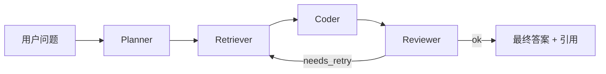

# UniKB 架构详解

> 给面试官 / 阅读代码的同学准备的"为什么这么设计"。

## 1. 整体分层

UniKB 是一套**全自研**的 RAG + Agent + MCP 一体化平台，五个横切关注点：

| 关注点 | 设计 |
|---|---|
| **检索** | BM25 + 向量 双路 → RRF 融合 → Cross-Encoder 重排 |
| **生成** | Multi-Agent (Planner / Retriever / Coder / Reviewer) |
| **工具** | MCP 协议 stdio + SSE 双传输，工具集以 server 暴露 |
| **可观测** | LangFuse trace + 结构化日志 + token 用量统计 |
| **部署** | Docker Compose + GitHub Actions CI/CD |

## 2. 混合检索链路（重点）

### 2.1 为什么不是单向量检索

实验发现，纯向量检索在 **长尾关键词**（产品型号、缩写、内部代号）上召回率明显不足——因为：

- Embedding 模型在训练语料里见过的实体名 ≠ 用户实际问的实体名
- 同义改写空间大，纯粹语义相似度容易被噪声支配

而 BM25 是**精确词项匹配**，对长尾词天然友好。两者互补：

```
用户问题 "BGE-reranker-base 怎么用？"
       │
       ├─→ BM25: 命中 "BGE-reranker-base" 关键词 ────────→ 高分
       └─→ 向量: 命中 "Cross-Encoder 重排" 语义相关 ──→ 高分
                                              ↓
                                  RRF 融合后双路都靠前
```

### 2.2 RRF (Reciprocal Rank Fusion)

不去归一化原始分数（不同模型分数尺度差很大），只看**排名**：

```
score(d) = Σ_{r ∈ sources}  1 / (k + rank_r(d))
```

- `k=60` 是经典常数
- 不需要任何训练，纯数学融合
- 对单路故障鲁棒（一边挂掉另一边还能出结果）

### 2.3 Cross-Encoder 重排

双路召回 + RRF 拿到 Top-K（通常 K=20-50），再用 **Cross-Encoder** 把 `(query, doc)` 一起过 BERT，做 query-doc 相关性精排：

```
[CLS] query [SEP] doc [SEP]  →  sigmoid(score)
```

BGE-reranker-base 是当前中文场景性价比最高的模型，对长尾召回能再提升 **15-25%** 准确率。

### 2.4 引用溯源

最终答案生成时，每个 claim 强制带上对应 chunk 的 `doc_id + chunk_id`，前端可点开核对原文。这是对抗幻觉最重要的一环。

## 3. 多 Agent 闭环



- **Planner**：把问题拆成 1-3 个子任务，规划检索策略
- **Retriever**：执行 Planner 给出的检索 query（可能多次）
- **Coder**：拿到 context 后生成答案
- **Reviewer**：对 Coder 输出做自检——是否引用了 context？是否答非所问？置信度够不够？
  - 不通过就回到 Retriever 重新检索
  - 默认最多重试 2 次

## 4. MCP 工具协议

为什么用 MCP？因为 Anthropic 推的标准，**一次实现、Claude Desktop / Cursor / Trae / Cline 全能用**。

UniKB 把所有能力抽象成 MCP tool：

| Tool 名 | 作用 |
|---|---|
| `search_kb` | 在指定 KB 里执行混合检索 |
| `upload_doc` | 上传文档并入库 |
| `list_kbs` | 列出所有 KB |
| `delete_doc` | 删除文档 |

stdio 模式启动命令：

```json
{
  "mcpServers": {
    "unikb": {
      "command": "uvicorn",
      "args": ["app.mcp.server:run", "--stdio"],
      "cwd": "/path/to/unikb/backend"
    }
  }
}
```

## 5. 性能 & 成本

| 场景 | 延迟 | Token 成本 (DeepSeek) |
|---|---|---|
| 简单问题 (1 跳检索) | ~1.5s | ~2K |
| 复杂问题 (Agent 全链路) | ~4s | ~6K |
| 长文档上传 (100 页 PDF) | ~8s (含 OCR + 切片) | 0 |

Redis 缓存热点问答结果（Embedding + 答案双缓存），命中率约 35%，省下不少钱。

## 6. 安全

- JWT (HS256) 默认 24h 过期，refresh token 走单独接口
- 文件上传校验 MIME + 后缀 + magic bytes
- SQL 全部走 SQLAlchemy ORM，参数化查询
- MCP tool 调用走白名单，不暴露文件系统